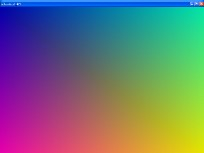



## Grad\_API

### Description

Gradient_API uses the 'GradientFillTriangle' API to create two opposed Gradient filled triangles. The effect is that you get a screen sized display that is a Gradient in all directions. By using the API, I can achieve very fast graphics. I set it up to use a Timer (tmrGrad_API) to continually refresh the display every second. I included a popup Speed control, accessible by right-clicking the form, so that the user may control the display speed. I set the minimum time to 10 milliseconds, which is too fast for me (it causes an annoying flashing). On the other hand, the maximum of 10 seconds is very slow (too slow for me). The colors of the 4 corners, and the direction that the triangles face, are chosen at random, so the display will be constantly changing.
 
### More Info
 
Nice looking Gradient graphics.

             |
---                |---
**Submitted On**   |2005-05-04 15:06:16
**By**             |[Randy Giese](https://github.com/Planet-Source-Code/PSCIndex/blob/master/ByAuthor/randy-giese.md)
**Level**          |Intermediate
**User Rating**    |4.8 (38 globes from 8 users)
**Compatibility**  |VB 6\.0
**Category**       |[Graphics](https://github.com/Planet-Source-Code/PSCIndex/blob/master/ByCategory/graphics__1-46.md)
**World**          |[Visual Basic](https://github.com/Planet-Source-Code/PSCIndex/blob/master/ByWorld/visual-basic.md)
**Archive File**   |[Grad\_API188464542005\.zip](https://github.com/Planet-Source-Code/randy-giese-grad-api__1-60370/archive/master.zip)

